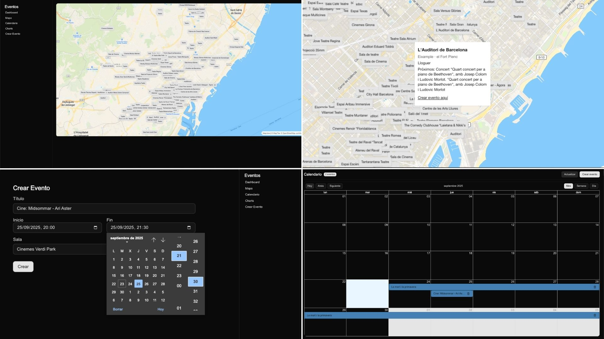

# 📊 Events Dashboard

This project is an **admin dashboard** built with **Next.js, React, and TypeScript**.  
It allows me to explore cultural venues in Barcelona (concert halls, theaters, etc.), visualize events on a map, manage a personal calendar, and see charts with aggregated data.

## Preview

[]()

## Technologies used
[](https://skillicons.dev)

- Next.js (App Router)
- React + TypeScript
- Tailwind CSS
- MapLibre GL + MapTiler
- React Big Calendar
- Tremor Charts
- Local JSON dataset (venues & events)

## Features

**Map of Venues**
- Interactive map using MapLibre GL.
- Markers for each cultural venue in Barcelona.
- Popup with venue details.

**Calendar**
- Based on React Big Calendar.
- Shows only events created by the user.
- Create event by clicking on a slot (day/week/month view).
- Delete event with a single click.

**Charts**
- Aggregated data visualization with Tremor.
- Distribution of events by venue and time.
- Planned: filters by district and venue capacity.

**CRUD for Events**
- Create: add events from a form or by clicking on the calendar.
- Read: load stored events and display them in the calendar & charts.
- Update: (planned) edit existing events.
- Delete: remove events directly from the calendar.

## Getting started

**Clone this repository**
```bash
git clone git@github.com:your-username/events-dashboard.git
```

**Install dependencies**
```bash
npm install
```

**Set up Environment Variables**

Create a `.env.local` file in the project root:
```bash
NEXT_PUBLIC_MAPTILER_API_KEY=your_maptiler_api_key
```

**Start Development Server**
```bash
npm run dev
```

## Project Structure
```
📁 src
├── app/
│   ├── dashboard/         ← Main dashboard pages (map, calendar, charts)
│   ├── api/               ← Event CRUD endpoints
├── components/            ← UI elements (forms, buttons, toolbar…)
├── lib/                   ← Data adapters, helpers (venuesRepo, eventsFromVenues)
├── public/data/           ← JSON dataset with venues
└── styles/                ← Global styles and Tailwind config
```

## Next Steps / To-do

- Implement event editing (Update).
- Add filters for calendar and charts (by venue, by district).
- Improve map popups with richer event details.
- Deploy to Vercel with real dataset.

## My Dev Journal

This project is my first attempt at combining **Next.js App Router** with multiple complex plugins in one dashboard.  
I integrated MapLibre GL to show cultural venues, React Big Calendar to handle personal events, and Tremor for charts. Getting all three to work together was a great learning experience.

One part I really enjoyed was making the calendar interactive: clicking on a slot to create events and deleting them directly. It made the project feel like a “real” app rather than just a demo. I also learned a lot about handling JSON datasets and transforming them into something usable for maps, calendars, and charts.

Overall, this project gave me a taste of what an actual **admin dashboard** might look like in production.

## Project Status

